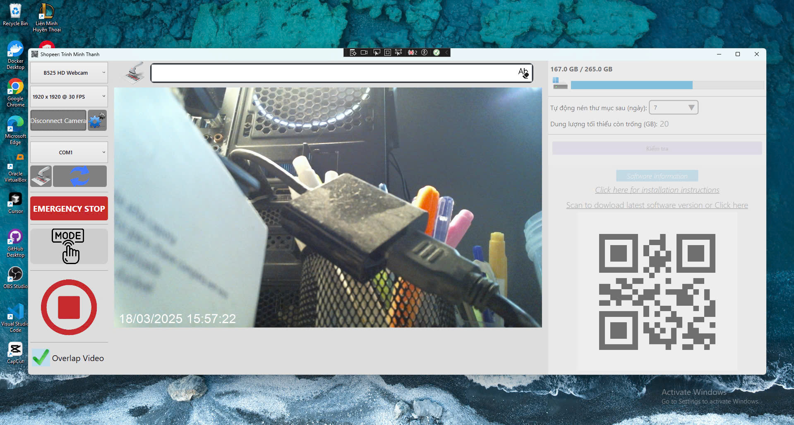
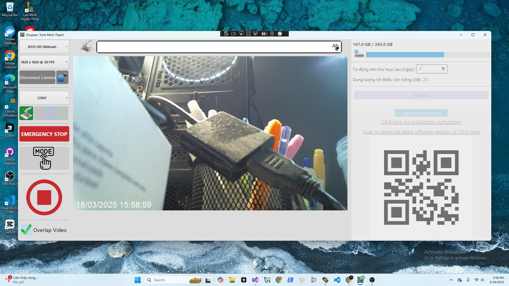
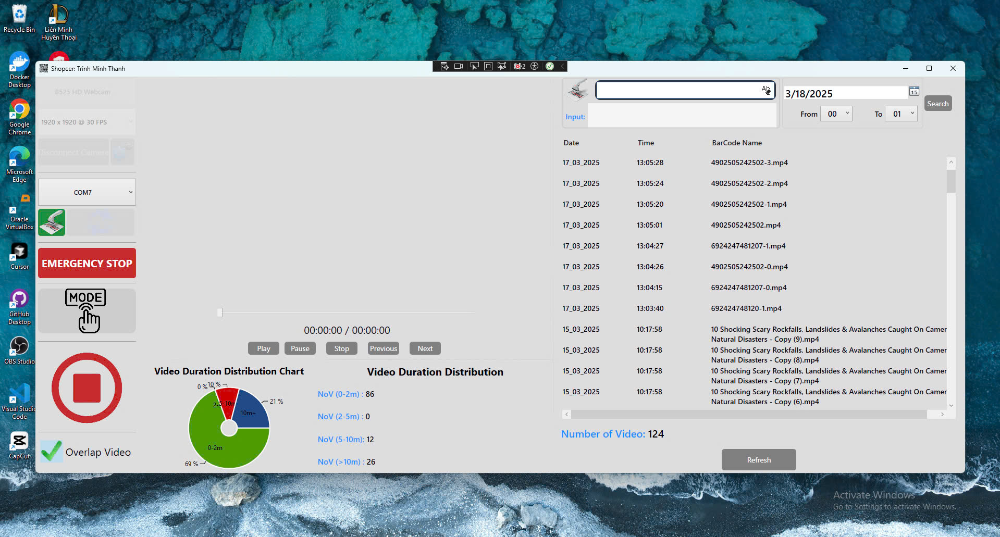
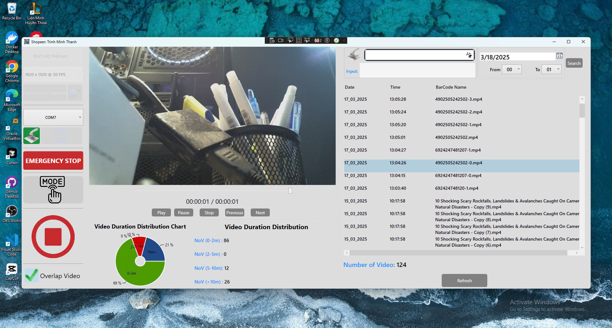
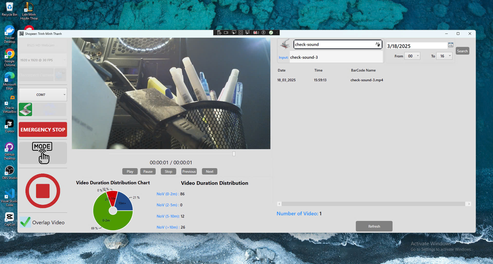

# ShopeeScanner-Release

## Video Demo Sản phần 
*[Link_Demo_ShopeeScanner](https://www.youtube.com/watch?v=tX6lUaeMZ7E)*


###  Giới thiệu và mô tả tính năng 
```
1. Ứng dụng này được tạo ra với mục đích hỗ trợ ghi hình quá trình đóng gói sản phẩm bằng cách sử dụng máy quét mã vạch thông qua giao tiếp USB-COM.
   Ứng dụng bắt đầu ghi hình quá trình đóng gói khi quét một mã vạch và kết thúc khi quét lại mã vạch đó hoặc một mã vạch mới.
```
```
2. Ứng dụng có tính năng tìm kiếm video theo mã vạch, tìm kiếm theo khoảng thời gian ngày và giờ, đồng thời cho phép nhập thủ công hoặc sử dụng máy quét để tìm kiếm.
```

```
3. Ứng dụng cho phép bạn chọn lưu video với tên file là mã đơn hàng có thể ghi đè hoặc không ghi đè.

```

```
4. Ứng dụng tự động cập nhật lên phiên bản mới nhất khi quét mã vạch cập nhật.

```

# Cách chạy ứng dụng

###  Tải Ứng Dụng về máy tính cá nhân của bạn bằng cách mở Terminal (của window) lên và gõ lệnh 
```shell
git clone https://github.com/VayneMai021296/ShopeeScanner-Release.git
```
<br>

###   Sau đó bạn nhấn 2 lần chuột trái vào file Scanner.exe (Có hình là mã QR) như hình vẽ dưới đây để chạy ứng dụng 
```CSS
- ShopeeScanner-Release
    |- .gitignore
    |- Scanner.exe
    |- ...
    |- LICENSE
    |- LICENSE.lic
```
<br>

###  Lần đầu tiên chạy ứng dụng Scanner lên bạn vui lòng gửi file LICENSE.info qua email maitrungkien1296@gmail.com để được cung cấp license.
* File LICENSE.info như file trong hình vẽ sau.

<br>


# Một số hình ảnh của ứng dụng

**`Bước 1:` Chọn Camera(USB interface) và chọn độ phân giải video bạn muốn lưu**

<br>
<br>

**`Bước 2:` Nhấn nút "Connect Camera" khi nút chuyển thành Disconnetc Camera là được <p>Bạn sẽ thấy hình ảnh của camera hiển thị và ngày giờ ở góc bên trái phía dưới**

<br>

**`Bước 3`: Chọn cổng COM của barcode để kết nối**

<br>

**`Bước 4:` Nhấn nút có biểu tượng barcode scanner để kết nối, nút nhấn chuyển thành màu xanh là đã kết nối thành công**

<br>

**`Bước 5:` Thực hiện quét mã sản phẩm để bắt đầu quá trình lưu lại video**

<br><p>

**`Bước 6:` Thực hiện quét mã sản phẩm lại một lần nữa để kết thúc quá trình lưu video**

<br>

**`Bước 7:` Chuyển sang chế độ tìm kiếm, để tìm kiếm video đã lưu<p>Biểu đồ thể hiện phần trằm, số lượng video có thời gian từ 0-2 phút, 2-5 phút,5-10 phút và trên 10 phút**

<br>

**`Bước 8:` Xem trực tiếp video đã được lưu từ danh sách đã lưu**

<br>

**`Bước 9:` Tìm kiếm video đã lưu bằng cách quét mã sản phẩm, tên mã sản phầm hiện thị lên ô có biểu tượng Barcode**

<br>
<br>

**`Bước 10:` Tìm kiếm video đã lưu bằng cách nhập mã sản phẩm vào ô phía dưới ô có biểu tượng barcode**

<br>

**`Bước 11:` Trở về chế độ lưu video và ngắt kết nối camera, nhân vào nút "Software Information" dể xem thông tin phần mềm<p> Nhấn vào "Click here for installation instructions"**

<br>

<br>

**`Bước 12:` Nhấn vào "Scan to dowload latest software version of Click here" để cập nhật phiên bản mới nhất hoặc quét mã để cập nhật, xuất hiện hộp thoại nhấn OK để cập nhật, nhấn Cancel để huỷ việc cập nhật**

<br>


**`Bước 13:` Sau khi nhấn OK, đợi khoảng 2,3 phút phần mềm sẽ tự tắt và khởi động lại<p>Khi phần mềm mở lên lại là quá trình cập nhật đã thành công**

<br>
